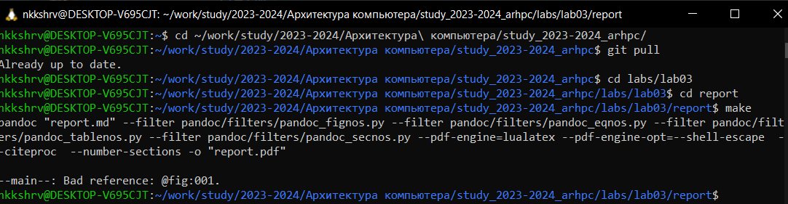
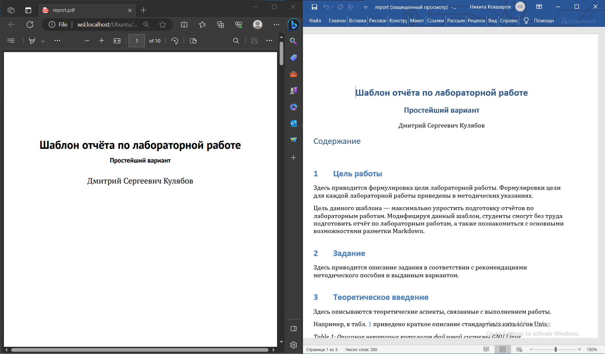
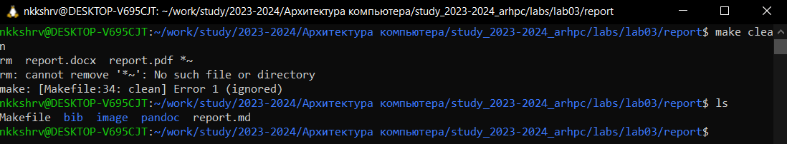
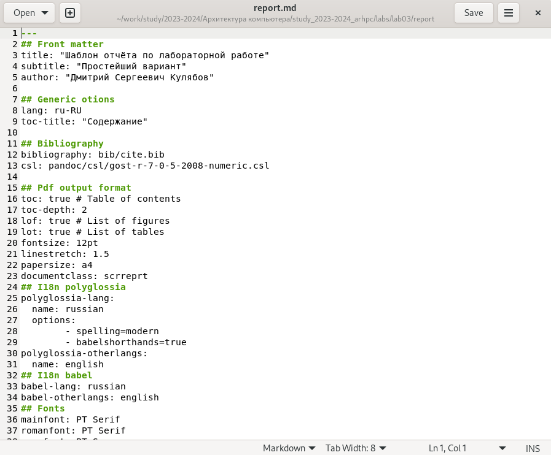
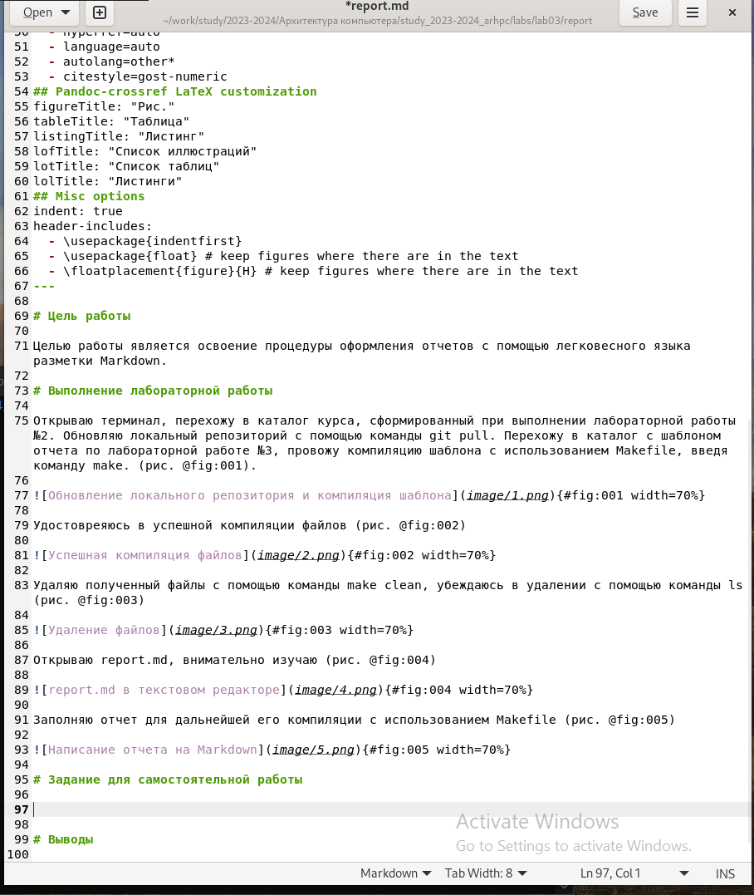
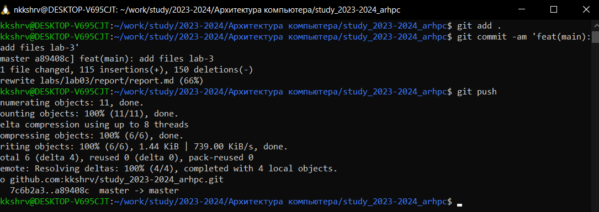
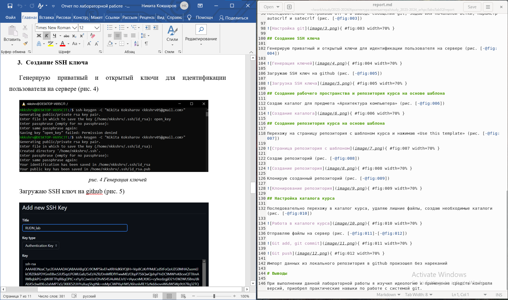
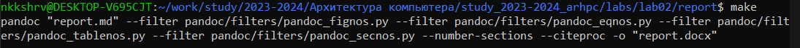
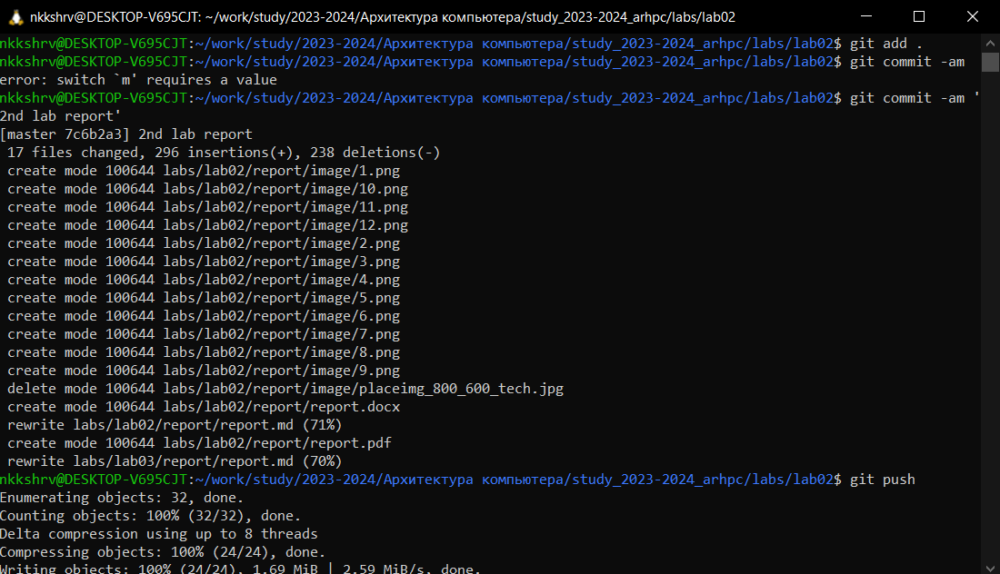

---
## Front matter
title: "Отчет по лабораторной работе №3"
subtitle: "Архитектура компьютеров и операционные системы"
author: "Никита Сергеевич Кокшаров"

## Generic otions
lang: ru-RU
toc-title: "Содержание"

## Bibliography
bibliography: bib/cite.bib
csl: pandoc/csl/gost-r-7-0-5-2008-numeric.csl

## Pdf output format
toc: true # Table of contents
toc-depth: 2
lof: true # List of figures
lot: false # List of tables
fontsize: 12pt
linestretch: 1.5
papersize: a4
documentclass: scrreprt
## I18n polyglossia
polyglossia-lang:
  name: russian
  options:
	- spelling=modern
	- babelshorthands=true
polyglossia-otherlangs:
  name: english
## I18n babel
babel-lang: russian
babel-otherlangs: english
## Fonts
mainfont: PT Serif
romanfont: PT Serif
sansfont: PT Sans
monofont: PT Mono
mainfontoptions: Ligatures=TeX
romanfontoptions: Ligatures=TeX
sansfontoptions: Ligatures=TeX,Scale=MatchLowercase
monofontoptions: Scale=MatchLowercase,Scale=0.9
## Biblatex
biblatex: true
biblio-style: "gost-numeric"
biblatexoptions:
  - parentracker=true
  - backend=biber
  - hyperref=auto
  - language=auto
  - autolang=other*
  - citestyle=gost-numeric
## Pandoc-crossref LaTeX customization
figureTitle: "Рис."
tableTitle: "Таблица"
listingTitle: "Листинг"
lofTitle: "Список иллюстраций"
lotTitle: "Список таблиц"
lolTitle: "Листинги"
## Misc options
indent: true
header-includes:
  - \usepackage{indentfirst}
  - \usepackage{float} # keep figures where there are in the text
  - \floatplacement{figure}{H} # keep figures where there are in the text
---

# Цель работы

Целью работы является освоение процедуры оформления отчетов с помощью легковесного языка разметки Markdown.

# Выполнение лабораторной работы

Открываю терминал, перехожу в каталог курса, сформированный при выполнении лабораторной работы №2. Обновляю локальный репозиторий с помощью команды git pull. Перехожу в каталог с шаблоном отчета по лабораторной работе №3, провожу компиляцию шаблона с использованием Makefile, введя команду make. (рис. @fig:001).

{#fig:001 width=70%}

Удостоверяюсь в успешной компиляции файлов (рис. @fig:002)

{#fig:002 width=70%}

Удаляю полученный файлы с помощью команды make clean, убеждаюсь в удалении с помощью команды ls (рис. @fig:003)

{#fig:003 width=70%}

Открываю report.md, внимательно изучаю (рис. @fig:004)

{#fig:004 width=70%}

Заполняю отчет для дальнейшей его компиляции с использованием Makefile (рис. @fig:005)

{#fig:005 width=70%}

Компилирую файлы и загружаю их на github (рис. @fig:006)

{#fig:006 width=70%}

# Задание для самостоятельной работы

Переписываю отчет по лабораторной работе №2 на языке Markdown (рис. @fig:007)

{#fig:007 width=70%}

Компилирую файлы отчета в форматах docx, pdf (рис. @fig:008)

{#fig:009 width=70%}

Загружаю файлы на github (рис. @fig:010)

{#fig:010 width=70%}

# Выводы

При выполнении данной лаборатной работы я столкнулся с многими проблемами, научился решать их (решение не вошло в отчет), ознакомился с языком разметки Markdown и процедурой оформления отчетов с его помощью.
