---
## Front matter
title: "Отчет по лабораторной работе №4"
subtitle: "Архитектура компьютеров и операционные системы"
author: "Никита Сергеевич Кокшаров"

## Generic otions
lang: ru-RU
toc-title: "Содержание"

## Bibliography
bibliography: bib/cite.bib
csl: pandoc/csl/gost-r-7-0-5-2008-numeric.csl

## Pdf output format
toc: true # Table of contents
toc-depth: 2
lof: true # List of figures
lol: false # List of listings
lot: false # List of tables
fontsize: 12pt
linestretch: 1.5
papersize: a4
documentclass: scrreprt
## I18n polyglossia
polyglossia-lang:
  name: russian
  options:
	- spelling=modern
	- babelshorthands=true
polyglossia-otherlangs:
  name: english
## I18n babel
babel-lang: russian
babel-otherlangs: english
## Fonts
mainfont: PT Serif
romanfont: PT Serif
sansfont: PT Sans
monofont: PT Mono
mainfontoptions: Ligatures=TeX
romanfontoptions: Ligatures=TeX
sansfontoptions: Ligatures=TeX,Scale=MatchLowercase
monofontoptions: Scale=MatchLowercase,Scale=0.9
## Biblatex
biblatex: true
biblio-style: "gost-numeric"
biblatexoptions:
  - parentracker=true
  - backend=biber
  - hyperref=auto
  - language=auto
  - autolang=other*
  - citestyle=gost-numeric
## Pandoc-crossref LaTeX customization
figureTitle: "Рис."
tableTitle: "Таблица"
listingTitle: "Листинг"
lofTitle: "Список иллюстраций"
lotTitle: "Список таблиц"
lolTitle: "Листинги"
## Misc options
indent: true
header-includes:
  - \usepackage{indentfirst}
  - \usepackage{float} # keep figures where there are in the text
  - \floatplacement{figure}{H} # keep figures where there are in the text
---

# Цель работы

Целью работы является освоение процедуры компиляции и сборки программ, написанных на ассемблере NASM.

# Выполнение лабораторной работы

## Программа Hello world!

Создаю каталог для работы с программами на языке ассемблера NASM, перехожу в созданный каталог, создаю текстовый файл hello.asm, открываю его (рис. @fig:001).

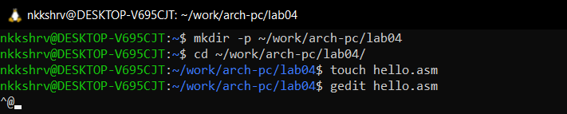{#fig:001 width=70%}

Ввожу текст, указанный в лабораторной работе, на языке NASM (рис. @fig:002)

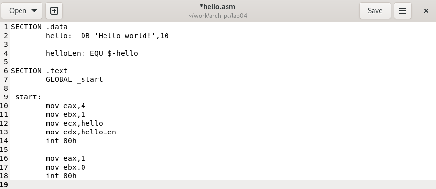{#fig:002 width=70%}

## Транслятор NASM

Превращаю текст программы в объектный код. Проверяю запись объектного кода в файл hello.o (рис. @fig:003)

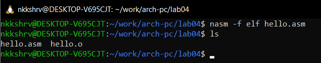{#fig:003 width=70%}

## Расширенный синтаксис командной строки NASM

Компилирую исходный файл hello.asm в obj.o, проверяю, что файл создан (рис. @fig:004)

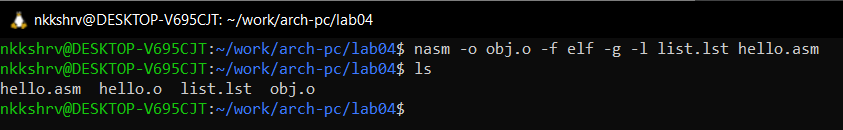{#fig:004 width=70%}

## Компоновщик LD

Передаю объектный файл на обработку компоновщику, проверяю создание исполняемой программы (hello) (рис. @fig:005)

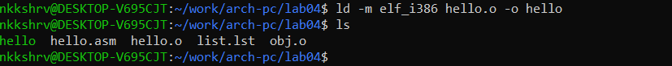{#fig:005 width=70%}

## Запуск исполняемого файла

Запускаю исполняемый файл hello (рис. @fig:011)

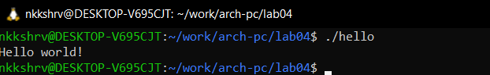{#fig:011 width=70%}

# Задание для самостоятельной работы

Cоздаю копию файла hello.asm с именем lab4.asm (рис. @fig:006)

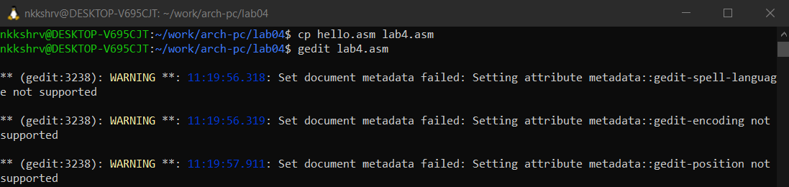{#fig:006 width=70%}

Меняю текст программы так, чтобы вместо Hello world! выводились мои фамилия и имя (рис. @fig:007)

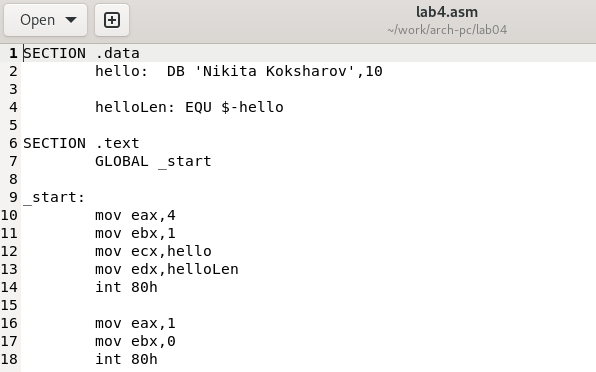{#fig:007 width=70%}

Транслирую полученный текст программы в объектный файл, выполняю компоновку объектного файла, запускаю получившийся исполняемый файл (рис. @fig:008)

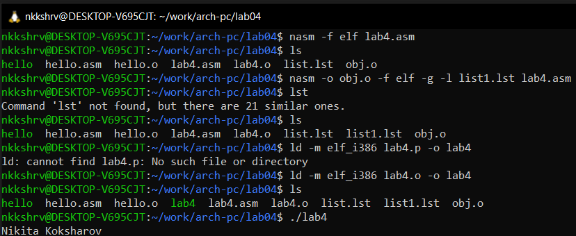{#fig:008 width=70%}

Листинг полученной программы (рис. @fig:012)

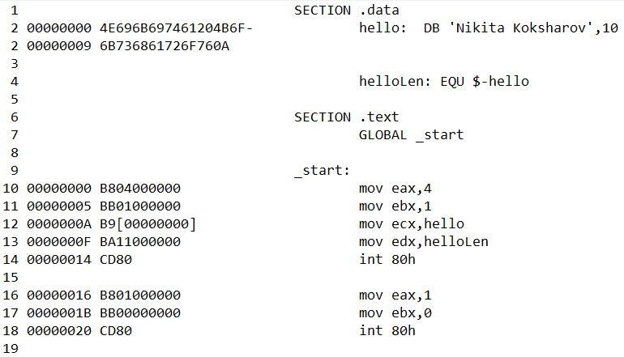{#fig:012 width=70%}

Перемещаю файлы hello.asm и lab4.asm в локальный репозиторий (рис. @fig:009)

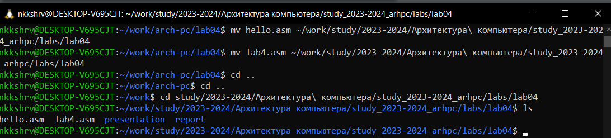{#fig:009 width=70%}

Загружаю файлы на Github (рис. @fig:010)

{#fig:010 width=70%}

# Выводы

При выполнении данной лаборатной работы я освоил процедуру компиляции и сборки программ, написанных на ассемблере NASM.
