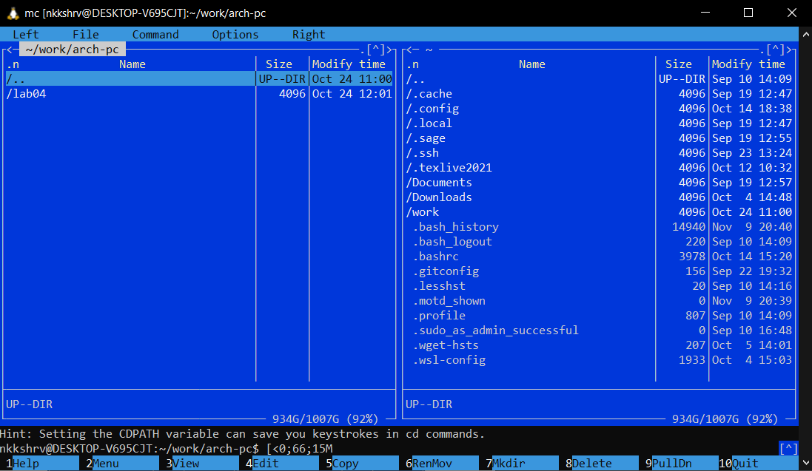
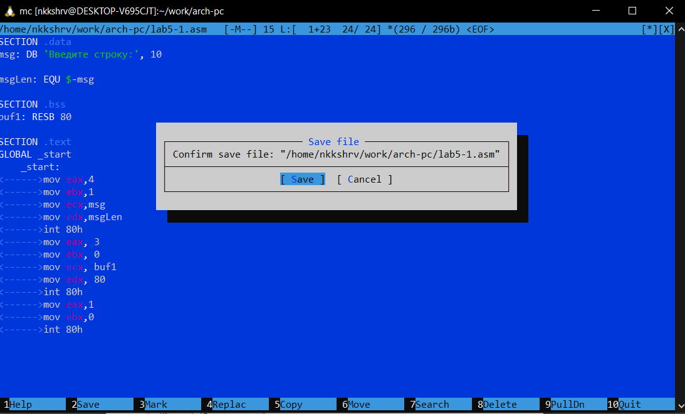

---
## Front matter
title: "Отчет по лабораторной работе №5"
subtitle: "Архитектура компьютеров и операционные системы"
author: "Никита Сергеевич Кокшаров"

## Generic otions
lang: ru-RU
toc-title: "Содержание"

## Bibliography
bibliography: bib/cite.bib
csl: pandoc/csl/gost-r-7-0-5-2008-numeric.csl

## Pdf output format
toc: true # Table of contents
toc-depth: 2
lof: true # List of figures
lol: false # List of listings
lot: false # List of tables
fontsize: 12pt
linestretch: 1.5
papersize: a4
documentclass: scrreprt
## I18n polyglossia
polyglossia-lang:
  name: russian
  options:
	- spelling=modern
	- babelshorthands=true
polyglossia-otherlangs:
  name: english
## I18n babel
babel-lang: russian
babel-otherlangs: english
## Fonts
mainfont: PT Serif
romanfont: PT Serif
sansfont: PT Sans
monofont: PT Mono
mainfontoptions: Ligatures=TeX
romanfontoptions: Ligatures=TeX
sansfontoptions: Ligatures=TeX,Scale=MatchLowercase
monofontoptions: Scale=MatchLowercase,Scale=0.9
## Biblatex
biblatex: true
biblio-style: "gost-numeric"
biblatexoptions:
  - parentracker=true
  - backend=biber
  - hyperref=auto
  - language=auto
  - autolang=other*
  - citestyle=gost-numeric
## Pandoc-crossref LaTeX customization
figureTitle: "Рис."
tableTitle: "Таблица"
listingTitle: "Листинг"
lofTitle: "Список иллюстраций"
lotTitle: "Список таблиц"
lolTitle: "Листинги"
## Misc options
indent: true
header-includes:
  - \usepackage{indentfirst}
  - \usepackage{float} # keep figures where there are in the text
  - \floatplacement{figure}{H} # keep figures where there are in the text
---

# Цель работы

Целью работы является приобретение навыков работы в MC и освоение инструкций языка ассемблера mov и int.

# Выполнение лабораторной работы

Открываю МС (рис. @fig:001).

{#fig:001 width=70%}

Перехожу в папку ~/work/arch-pc (рис. @fig:002)

{#fig:002 width=70%}

Создаю папку lab05 (рис. @fig:003)

{#fig:003 width=70%}

Cоздаю lab05-1.asm (рис. @fig:004)

{#fig:004 width=70%}

Перехожу в lab05-1.asm (рис. @fig:005)

{#fig:005 width=70%}

Cохраняю написанный код (рис. @fig:006)

{#fig:006 width=70%}

Убеждаюсь в наличии кода в файле (рис. @fig:007)

{#fig:007 width=70%}

Транслирую, выполняю компоновку и запускаю полученный исполняемый файл(рис. @fig:008)

{#fig:008 width=70%}

## Подключение внешнего файла in_out.asm

Переношу in_out.asm в каталог с программой (рис. @fig:009)

{#fig:009 width=70%}

Делаю копию файла lab5-1.asm (рис. @fig:010)

{#fig:010 width=70%}

Имплементирую подпрограммы из in_out.asm в lab5-2.asm (рис. @fig:011)

{#fig:011 width=70%}

Транслирую, выполняю компоновку и запускаю lab5-2 (рис. @fig:012)

{#fig:012 width=70%}

Заменяю sprintLF в lab5-2 на sprint (рис. @fig:013)

{#fig:013 width=70%}

Транслирую, выполняю компоновку и запускаю lab5-2 (рис. @fig:014)

{#fig:014 width=70%}

Разница между программами наглядна на рис. @fig:012 и рис. @fig:014 При имплементации sprintLF вместо sprint присутствует дополнительная новая строка.

# Задание для самостоятельной работы

Пишу код для программы, выводящей строку, введенную пользователем (рис. @fig:015)

{#fig:015 width=70%}

Транслирую, выполняю компоновку и запускаю COPYlab5-1 (рис. @fig:016)

{#fig:016 width=70%}

Используя подпрограмму из in_out.asm, пишу код для программы, выводящей строку, введенную пользователем (рис. @fig:017)

{#fig:017 width=70%}

Транслирую, выполняю компоновку и запускаю COPYlab5-2 (рис. @fig:018)

{#fig:018 width=70%}

# Выводы

При выполнении данной лаборатной работы я ознакомился с MC и освоил инструкции языка ассемблера mov и int.
