---
## Front matter
title: "Отчет по лабораторной работе №6"
subtitle: "Архитектура компьютеров и операционные системы"
author: "Никита Сергеевич Кокшаров"

## Generic otions
lang: ru-RU
toc-title: "Содержание"

## Bibliography
bibliography: bib/cite.bib
csl: pandoc/csl/gost-r-7-0-5-2008-numeric.csl

## Pdf output format
toc: true # Table of contents
toc-depth: 2
lof: true # List of figures
lol: false # List of listings
lot: false # List of tables
fontsize: 12pt
linestretch: 1.5
papersize: a4
documentclass: scrreprt
## I18n polyglossia
polyglossia-lang:
  name: russian
  options:
	- spelling=modern
	- babelshorthands=true
polyglossia-otherlangs:
  name: english
## I18n babel
babel-lang: russian
babel-otherlangs: english
## Fonts
mainfont: PT Serif
romanfont: PT Serif
sansfont: PT Sans
monofont: PT Mono
mainfontoptions: Ligatures=TeX
romanfontoptions: Ligatures=TeX
sansfontoptions: Ligatures=TeX,Scale=MatchLowercase
monofontoptions: Scale=MatchLowercase,Scale=0.9
## Biblatex
biblatex: true
biblio-style: "gost-numeric"
biblatexoptions:
  - parentracker=true
  - backend=biber
  - hyperref=auto
  - language=auto
  - autolang=other*
  - citestyle=gost-numeric
## Pandoc-crossref LaTeX customization
figureTitle: "Рис."
tableTitle: "Таблица"
listingTitle: "Листинг"
lofTitle: "Список иллюстраций"
lotTitle: "Список таблиц"
lolTitle: "Листинги"
## Misc options
indent: true
header-includes:
  - \usepackage{indentfirst}
  - \usepackage{float} # keep figures where there are in the text
  - \floatplacement{figure}{H} # keep figures where there are in the text
---

# Цель работы

Целью работы является освоение арифметических инструкций языка ассемблера NASM.

# Выполнение лабораторной работы

## Символьные и численные данные в NASM

Создаю файл lab6-1.asm в новой директории lab06 (рис. @fig:001).

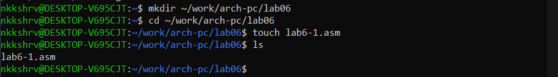{#fig:001 width=70%}

Пишу код программы из листинга 6.1 (рис. @fig:002)

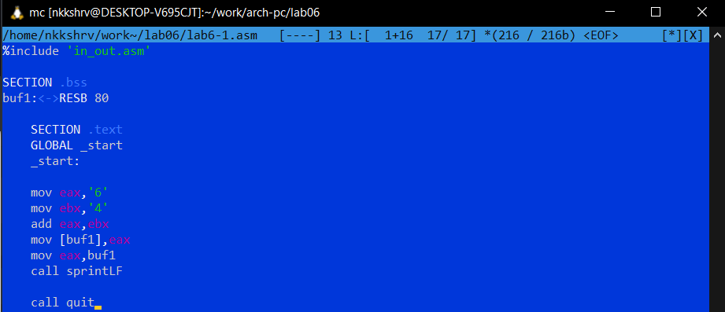{#fig:002 width=70%}

Создаю исполняемый файл и запускаю его (рис. @fig:003)

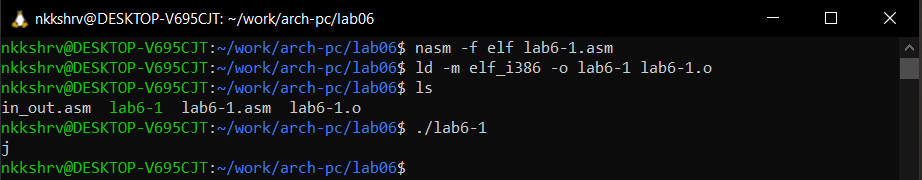{#fig:003 width=70%}

Изменяю код программы (рис. @fig:004)

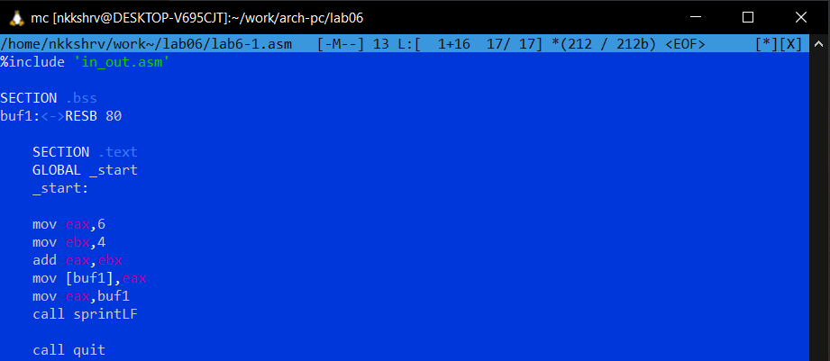{#fig:004 width=70%}

Создаю исполняемый файл и запускаю его (рис. @fig:005)

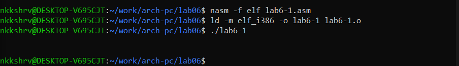{#fig:005 width=70%}

Во втором случае выводится символ с кодом 10. В соответствии с таблицей ASCII таким символом является STX (Start of Text). Он не отображается.

Создаю lab6-2.asm. Пишу код программы из листинга 6.2 (рис. @fig:006)

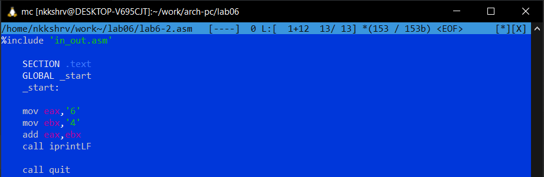{#fig:006 width=70%}

Создаю исполняемый файл и запускаю его (рис. @fig:007)

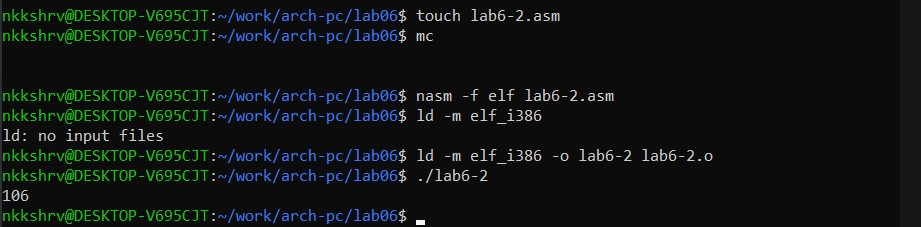{#fig:007 width=70%}

Изменяю код программы (рис. @fig:008)

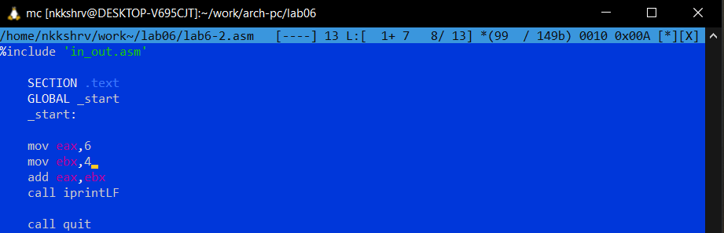{#fig:008 width=70%}

Создаю исполняемый файл и запускаю его (рис. @fig:009)

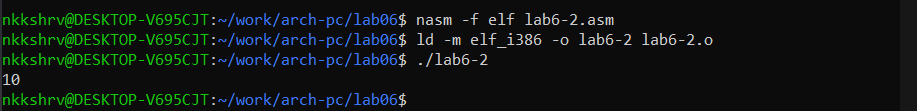{#fig:009 width=70%}

Результат выполнения программы поменялся: вывод 106 сменился на вывод 10.

Меняю вызов подпрограммы iprintLF на iprint (рис. @fig:010)

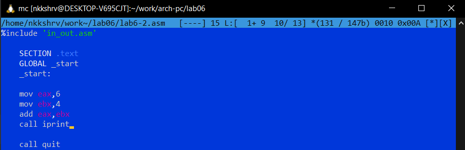{#fig:010 width=70%}

Создаю исполняемый файл и запускаю его (рис. @fig:019)

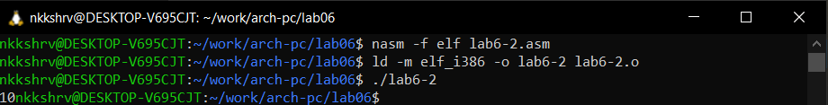{#fig:019 width=70%}

##  Выполнение арифметических операций в NASM

Пишу код программы из листинга 6.3 (рис. @fig:011)

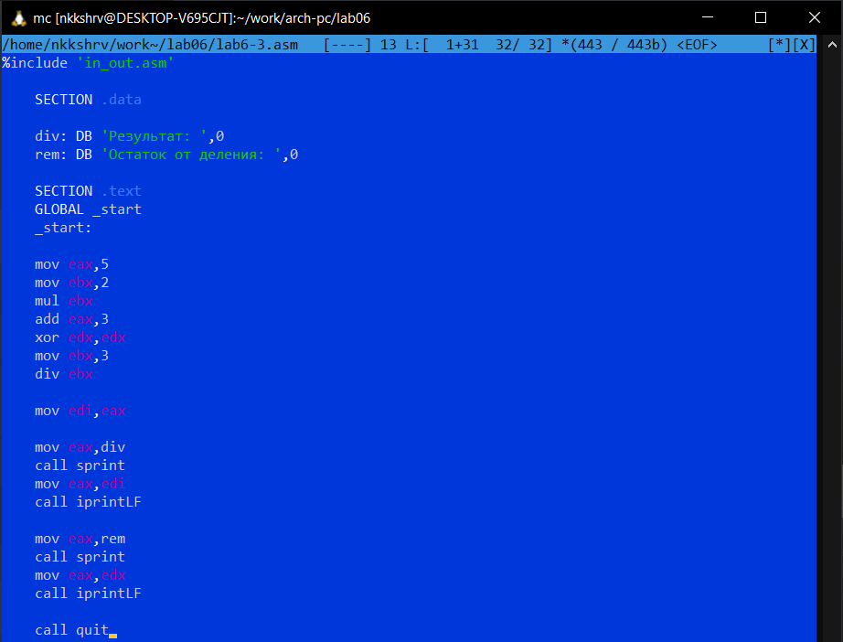{#fig:011 width=70%}

Создаю исполняемый файл и запускаю его (рис. @fig:012)

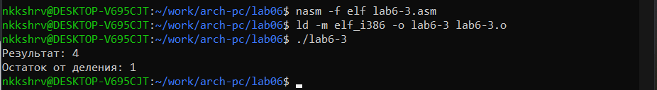{#fig:012 width=70%}

Меняю код программы для вычисления значения выражения $f(x) = (4 * 6 + 2)/5$ (рис. @fig:013)

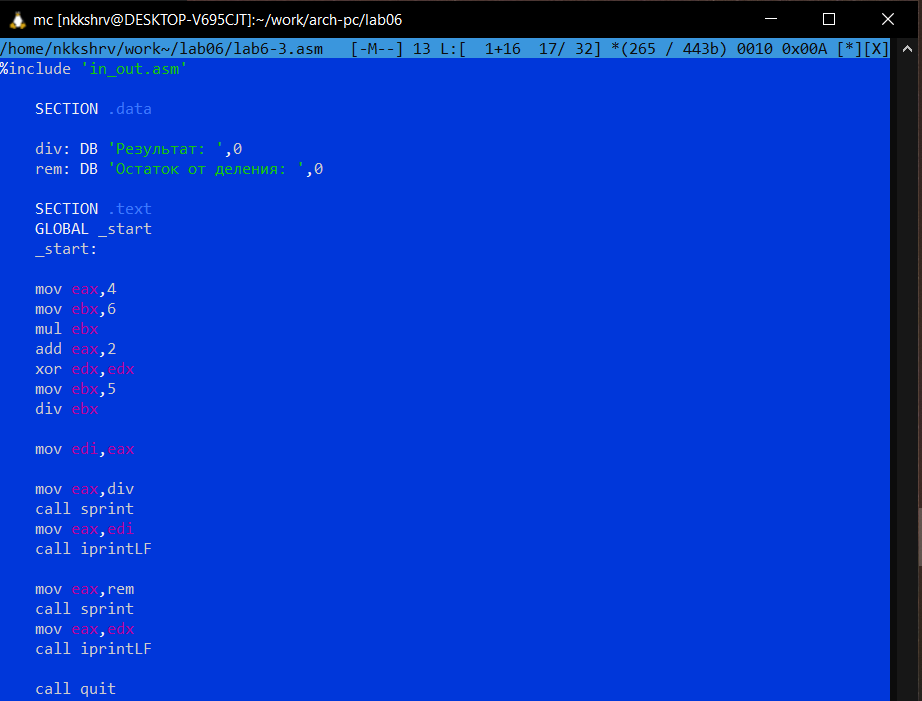{#fig:013 width=70%}

Создаю исполняемый файл и запускаю его (рис. @fig:014)

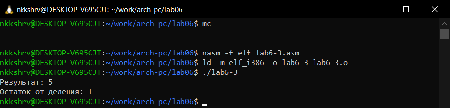{#fig:014 width=70%}

Результат верный.

Пишу код программы из листинга 6.4 (рис. @fig:015)

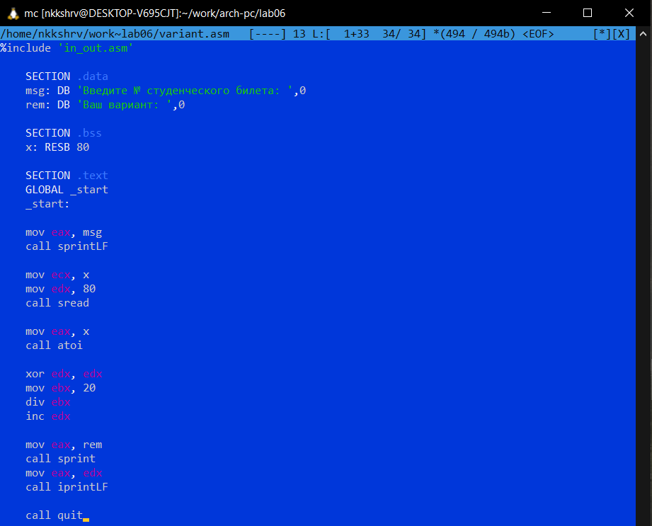{#fig:015 width=70%}

Создаю исполняемый файл и запускаю его (рис. @fig:016)

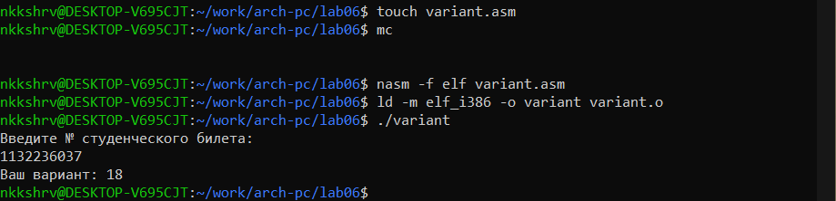{#fig:016 width=70%}

## Ответы на вопросы

1. Какие строки листинга 6.4 отвечают за вывод на экран сообщения ‘Ваш вариант:’?

Ответ:
```
mov eax,rem
call sprint
```

2. Для чего используется следующие инструкции?

```
mov ecx, x
mov edx, 80
call sread
```

Ответ:
Инструкция ```mov ecx, x``` используется, чтобы положить адрес вводимой строки x в регистр ecx, ```mov edx, 80``` - запись в регистр edx длины вводимой строки, ```call sread``` - вызов подпрограммы из внешнего файла, обеспечивающей ввод сообщения с клавиатуры

3. Для чего используется инструкция “call atoi”?

Ответ:
С помощью “call atoi” мы вызываем функцию atoi, которая преобразует ascii-код символа в целое число и записывает результат в регистр eax (перед вызовом atoi в регистр eax необходимо записать число). 

4. Какие строки листинга 6.4 отвечают за вычисления варианта?

Ответ:
```
xor edx,edx
mov ebx,20
div ebx
inc edx
```

5. В какой регистр записывается остаток от деления при выполнении инструкции “div ebx”?

Ответ:

Остаток запиысвается в регистр edx.

6. Для чего используется инструкция “inc edx”?

Ответ:

Для того, чтобы инкрементировать значение в регистре edx.

7. Какие строки листинга 6.4 отвечают за вывод на экран результата вычислений?

Ответ:
```
mov eax,edx
call iprintLF
```

# Задание для самостоятельной работы

Мой вариант — номер 18.

Пишу для вычисления значения данной функции $f(x) = 3(x + 10) - 20$ (рис. @fig:017)

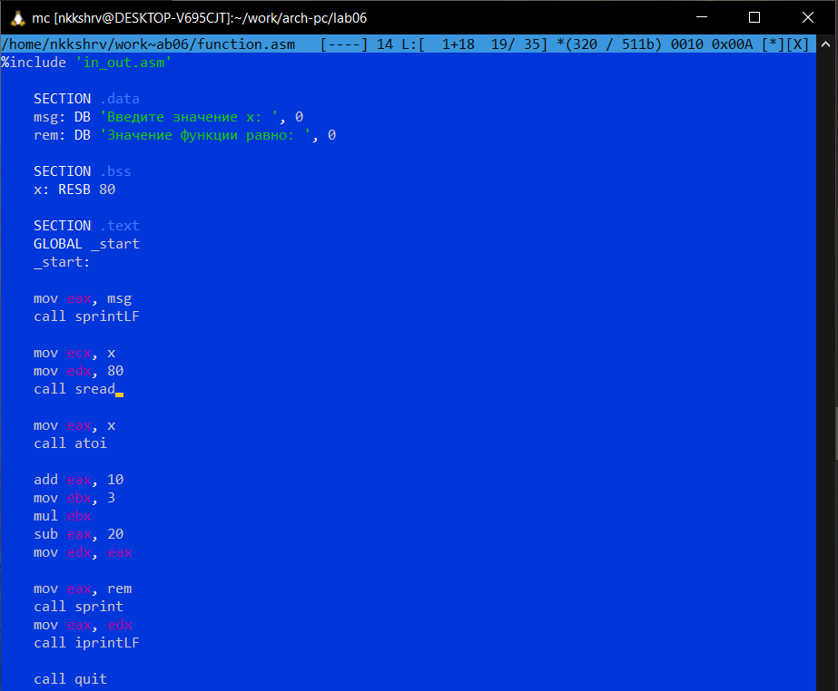{#fig:017 width=70%}

Создаю исполняемый файл и запускаю его. Ввожу данные значения x для проверки. Получаю верные ответы (рис. @fig:018)

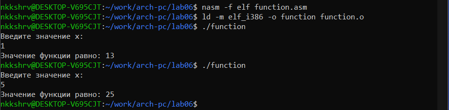{#fig:018 width=70%}

# Выводы

При выполнении данной лаборатной работы я освоил арифметические инструкции языка ассемблера NASM.
