---
## Front matter
title: "Отчет по лабораторной работе №7"
subtitle: "Архитектура компьютеров и операционные системы"
author: "Никита Сергеевич Кокшаров"

## Generic otions
lang: ru-RU
toc-title: "Содержание"

## Bibliography
bibliography: bib/cite.bib
csl: pandoc/csl/gost-r-7-0-5-2008-numeric.csl

## Pdf output format
toc: true # Table of contents
toc-depth: 2
lof: true # List of figures
lol: false # List of listings
lot: false # List of tables
fontsize: 12pt
linestretch: 1.5
papersize: a4
documentclass: scrreprt
## I18n polyglossia
polyglossia-lang:
  name: russian
  options:
	- spelling=modern
	- babelshorthands=true
polyglossia-otherlangs:
  name: english
## I18n babel
babel-lang: russian
babel-otherlangs: english
## Fonts
mainfont: PT Serif
romanfont: PT Serif
sansfont: PT Sans
monofont: PT Mono
mainfontoptions: Ligatures=TeX
romanfontoptions: Ligatures=TeX
sansfontoptions: Ligatures=TeX,Scale=MatchLowercase
monofontoptions: Scale=MatchLowercase,Scale=0.9
## Biblatex
biblatex: true
biblio-style: "gost-numeric"
biblatexoptions:
  - parentracker=true
  - backend=biber
  - hyperref=auto
  - language=auto
  - autolang=other*
  - citestyle=gost-numeric
## Pandoc-crossref LaTeX customization
figureTitle: "Рис."
tableTitle: "Таблица"
listingTitle: "Листинг"
lofTitle: "Список иллюстраций"
lotTitle: "Список таблиц"
lolTitle: "Листинги"
## Misc options
indent: true
header-includes:
  - \usepackage{indentfirst}
  - \usepackage{float} # keep figures where there are in the text
  - \floatplacement{figure}{H} # keep figures where there are in the text
---

# Цель работы

Целью работы является изучение команд условного и безусловного переходов, приобретение навыков написания программ с использованием переходов и знакомство с назначением и структурой файла листинга.

# Выполнение лабораторной работы

## Реализация переходов в NASM

Создаю файл lab7-1.asm в новой директории lab07 (рис. @fig:001).

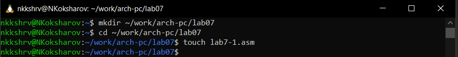{#fig:001 width=70%}

Пишу код программы из листинга 7.1 (рис. @fig:002)

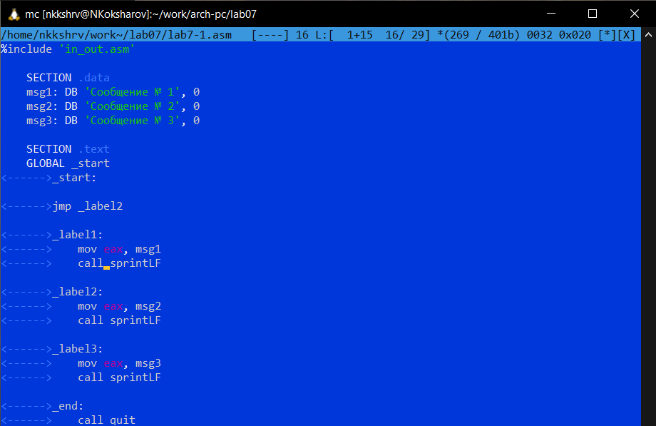{#fig:002 width=70%}

Создаю исполняемый файл и запускаю его (рис. @fig:003)

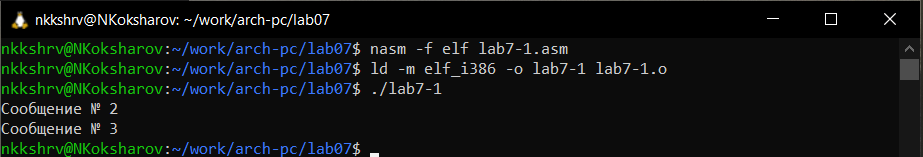{#fig:003 width=70%}

Изменяю код программы (рис. @fig:004)

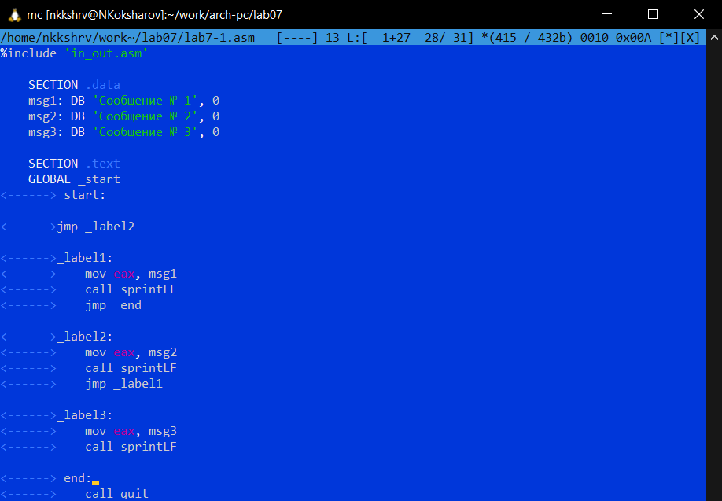{#fig:004 width=70%}

Создаю исполняемый файл и запускаю его (рис. @fig:005)

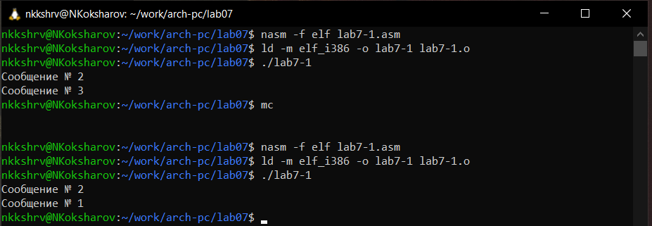{#fig:005 width=70%}

Разница вывода наглядна на изображении.

Изменяю код программы в соответствии с листингом 7.2, делаю так, чтобы вывод был следующим: Сообщение №3, Сообщение №2, Сообщение №1 (рис. @fig:006)

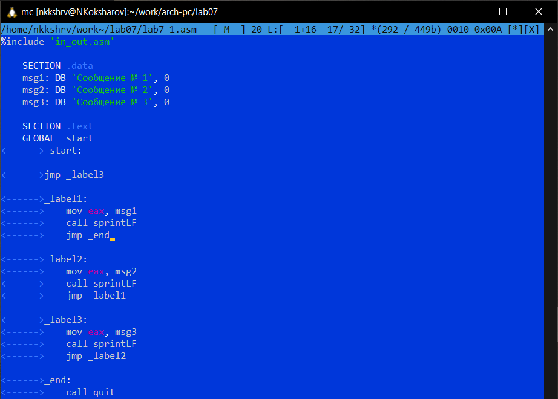{#fig:006 width=70%}

Создаю исполняемый файл и запускаю его (рис. @fig:007)

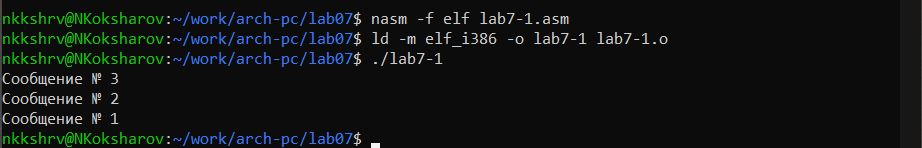{#fig:007 width=70%}

Создаю lab7-2.asm, пишу туда код из листинга 7.3 (рис. @fig:008)

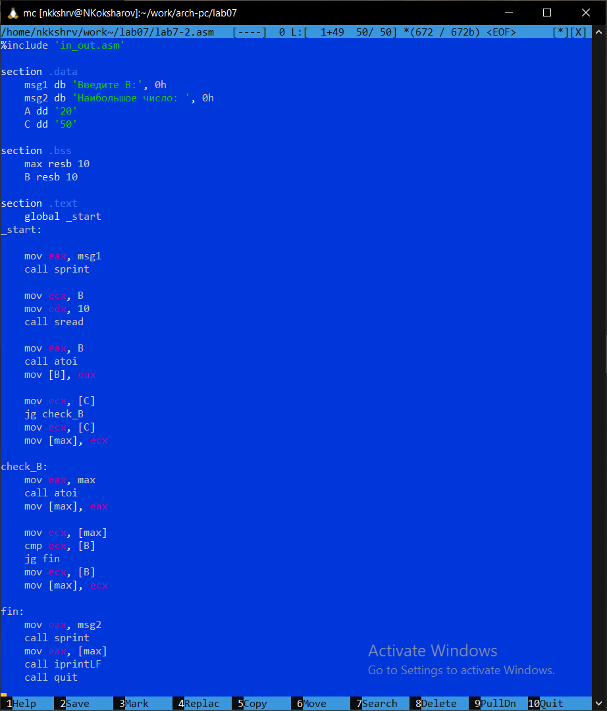{#fig:008 width=70%}

Создаю исполняемый файл и запускаю его, проверяю для разных значений В (рис. @fig:009)

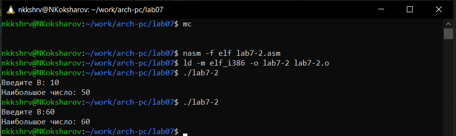{#fig:009 width=70%}

## Изучение структуры файла листинга

Создаю файл листинга и открываю его (рис. @fig:010)

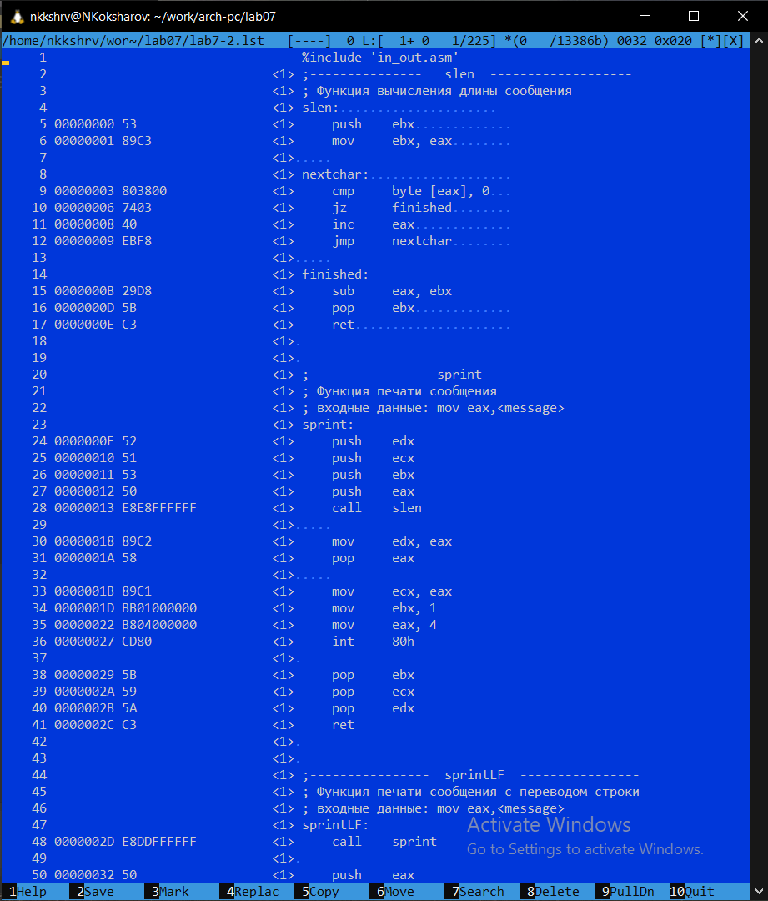{#fig:010 width=70%}

Cтрочка 17 (основной программы): ```mov eax, msg1``` - в регистр ```eax``` передается содержимое переменной ```msg1```

Строчка 29 (основной программы): ```jg check_B``` - условный переход к ```check_B```, если ```ecx``` > ```[C]```

Строчка 40 (основной программы): ```jf fin``` - условный переход к ```fin```, если ```ecx``` > ```[B]```

При удалении в 50-й строчки одного из операндов и создания листинга измененного файла терминал указывает на ошибку в коде (рис. @fig:011)

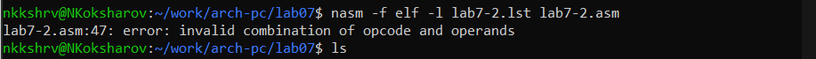{#fig:011 width=70%}

В файле листинга также указана ошибка (рис. @fig:012)

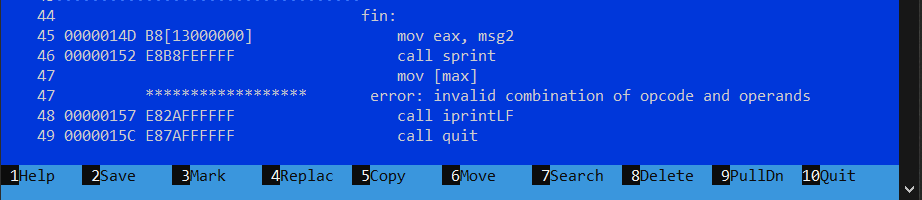{#fig:012 width=70%}

## Задания для самостоятельной работы

Мой вариант: №18

Пишу код для задачи под номером 1 (рис. @fig:013)

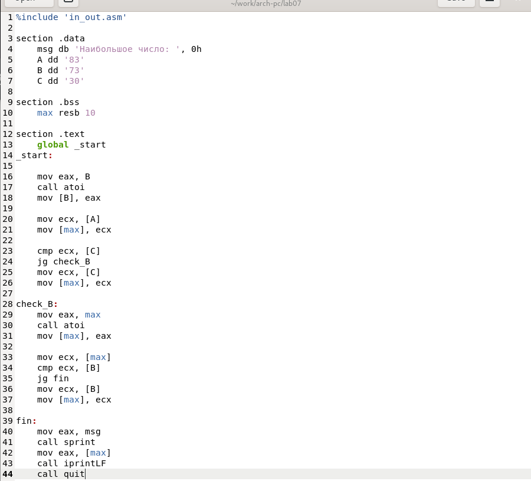{#fig:013 width=70%}

Создаю исполняемый файл и запускаю его (рис. @fig:014)

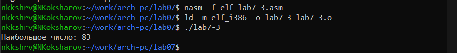{#fig:014 width=70%}

Результат верный.

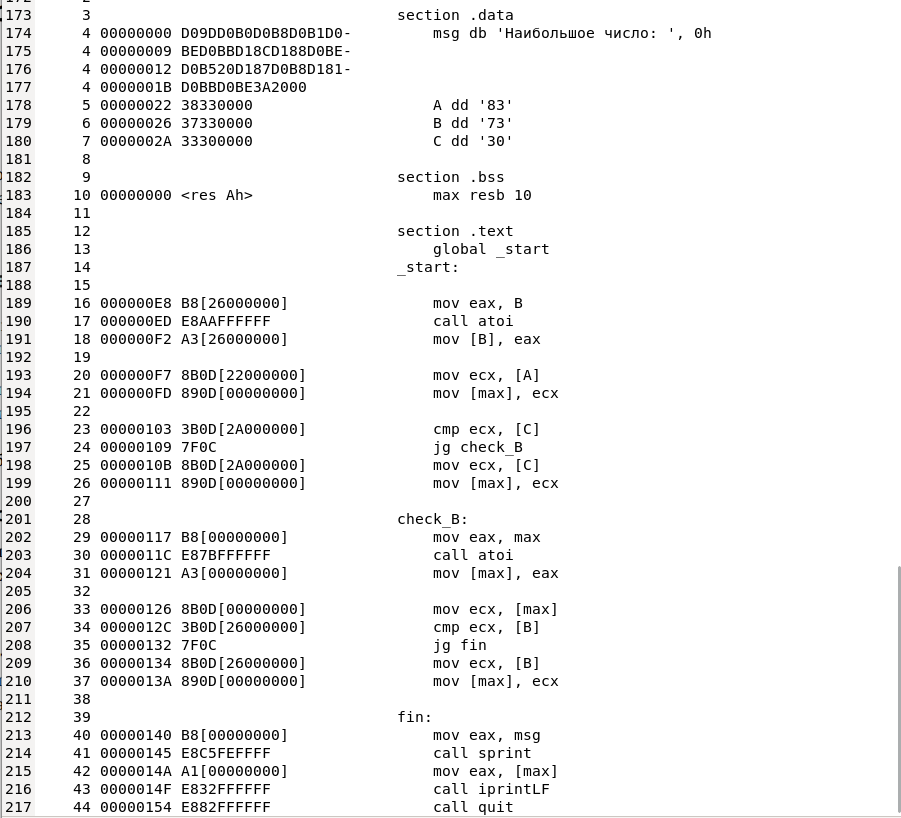{#fig:017 width=70%}

Пишу код для задачи под номером 2 (рис. @fig:015)

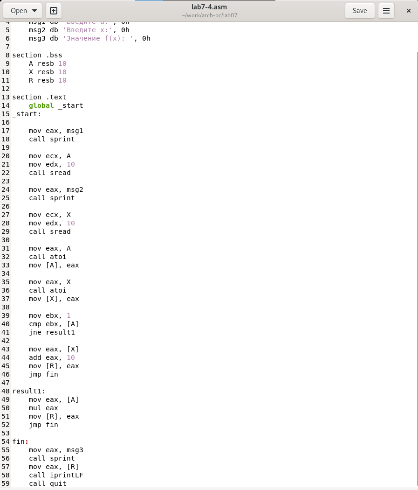{#fig:015 width=70%}

Создаю исполняемый файл и запускаю его (рис. @fig:016)

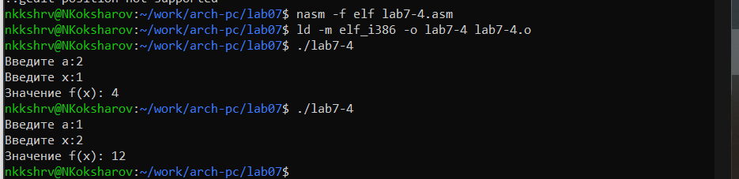{#fig:016 width=70%}

Для данных $x_1, a_1, x_2, a_2$ результат верный.

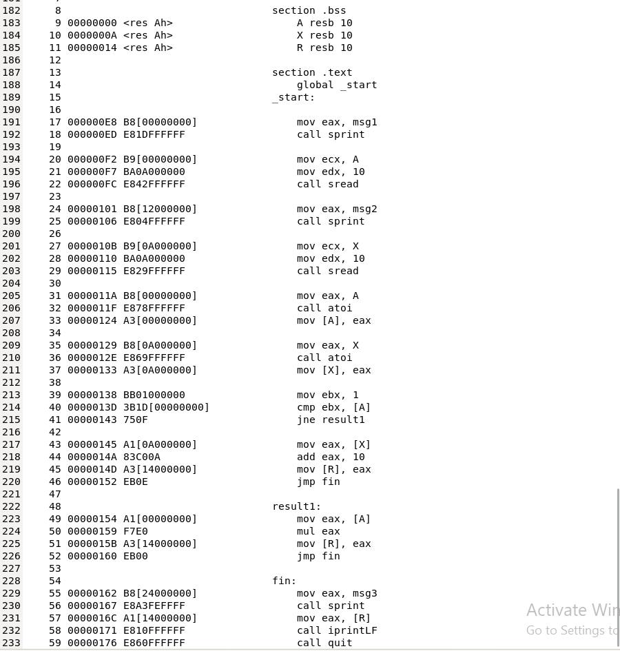{#fig:018 width=70%}

# Выводы

При выполнении лабораторной работы я изучил команды условного и безусловного переходов, приобрел навыки написания программ с использованием переходов и ознакомился с назначением и структурой файла листинга.
