---
## Front matter
title: "Отчет по лабораторной работе №8"
subtitle: "Архитектура компьютеров и операционные системы"
author: "Никита Сергеевич Кокшаров"

## Generic otions
lang: ru-RU
toc-title: "Содержание"

## Bibliography
bibliography: bib/cite.bib
csl: pandoc/csl/gost-r-7-0-5-2008-numeric.csl

## Pdf output format
toc: true # Table of contents
toc-depth: 2
lof: true # List of figures
lol: false # List of listings
lot: false # List of tables
fontsize: 12pt
linestretch: 1.5
papersize: a4
documentclass: scrreprt
## I18n polyglossia
polyglossia-lang:
  name: russian
  options:
	- spelling=modern
	- babelshorthands=true
polyglossia-otherlangs:
  name: english
## I18n babel
babel-lang: russian
babel-otherlangs: english
## Fonts
mainfont: PT Serif
romanfont: PT Serif
sansfont: PT Sans
monofont: PT Mono
mainfontoptions: Ligatures=TeX
romanfontoptions: Ligatures=TeX
sansfontoptions: Ligatures=TeX,Scale=MatchLowercase
monofontoptions: Scale=MatchLowercase,Scale=0.9
## Biblatex
biblatex: true
biblio-style: "gost-numeric"
biblatexoptions:
  - parentracker=true
  - backend=biber
  - hyperref=auto
  - language=auto
  - autolang=other*
  - citestyle=gost-numeric
## Pandoc-crossref LaTeX customization
figureTitle: "Рис."
tableTitle: "Таблица"
listingTitle: "Листинг"
lofTitle: "Список иллюстраций"
lotTitle: "Список таблиц"
lolTitle: "Листинги"
## Misc options
indent: true
header-includes:
  - \usepackage{indentfirst}
  - \usepackage{float} # keep figures where there are in the text
  - \floatplacement{figure}{H} # keep figures where there are in the text
---

# Цель работы

Целью работы является приобретение навыков написания программ с использование циклов и обработкой аргументов командной строки.

# Выполнение лабораторной работы

## Реализация циклов в NASM

Создаю файл lab8-1.asm в новой директории lab07 (рис. @fig:001).

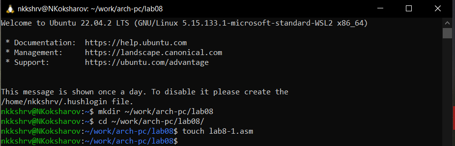{#fig:001 width=70%}

Пишу код программы из листинга 8.1 (рис. @fig:002)

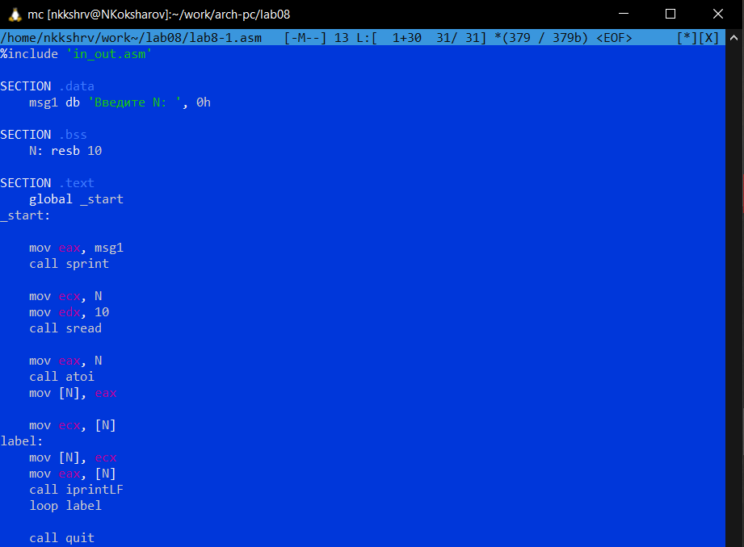{#fig:002 width=70%}

Создаю исполняемый файл и запускаю его (рис. @fig:003)

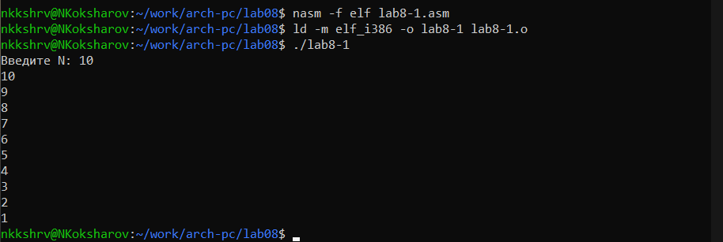{#fig:003 width=70%}

Изменяю код программы (рис. @fig:004)

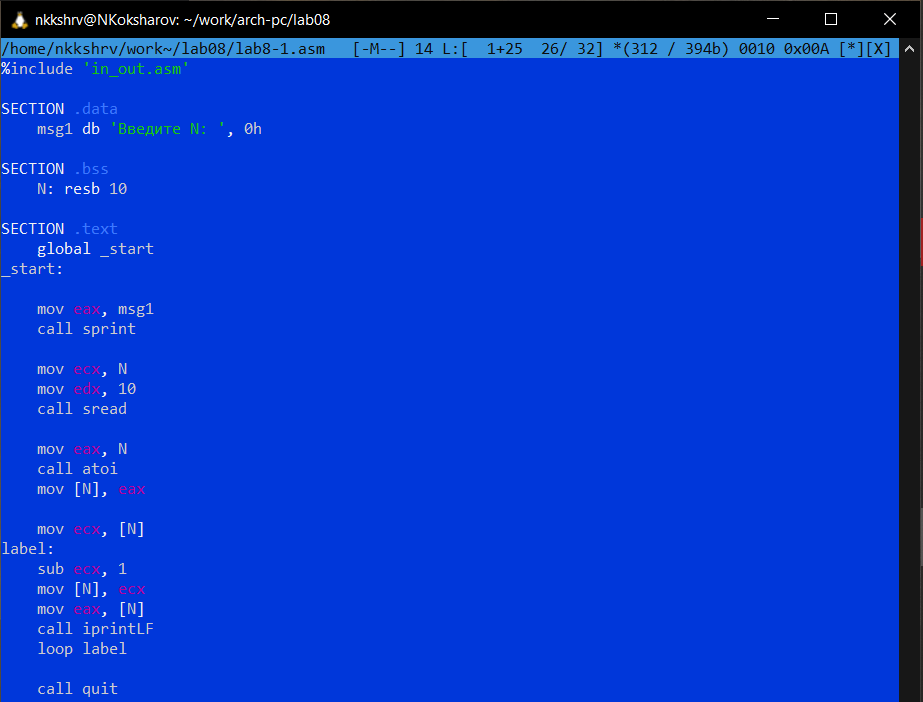{#fig:004 width=70%}

Создаю исполняемый файл и запускаю его (рис. @fig:005)

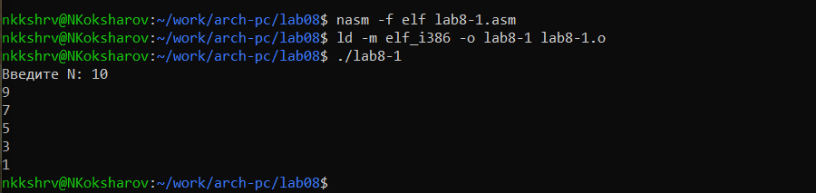{#fig:005 width=70%}

Разница вывода наглядна на изображении: поскольку из регистра ```ecx``` с каждым проходом цикла вычитается единица (```sub ecx, 1```) при вводе четного числа (например, 10) будут выведены все меньшие нечетные числа, при вводе нечетного числа - все меньшие четные числа. Очевидно, число проходов цикла не соотвествует значению ```N```, введенному с клавиатуры.

Изменяю код программы, используя стек (рис. @fig:006)

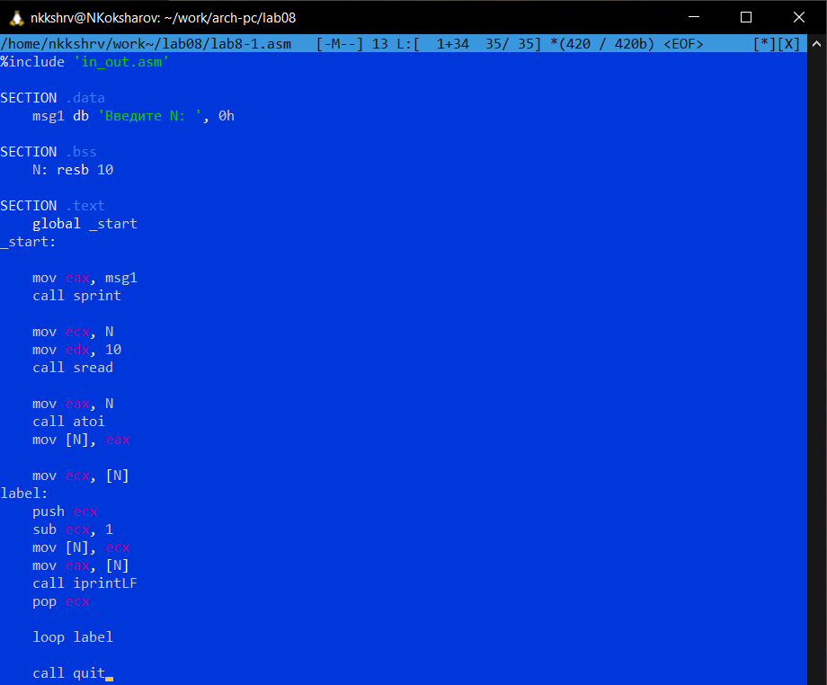{#fig:006 width=70%}

Создаю исполняемый файл и запускаю его (рис. @fig:007)

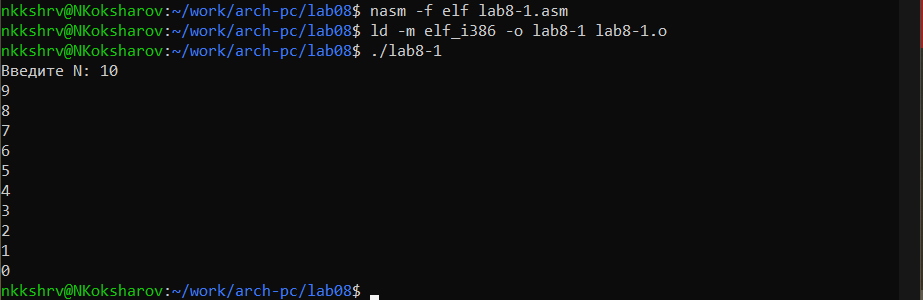{#fig:007 width=70%}

В данном случае число проходов цикла соответствует значению ```N```, введенному с клавиатуры.

## Обработка аргументов командной строки

Создаю lab8-2.asm, пишу туда код из листинга 8.2 (рис. @fig:008)

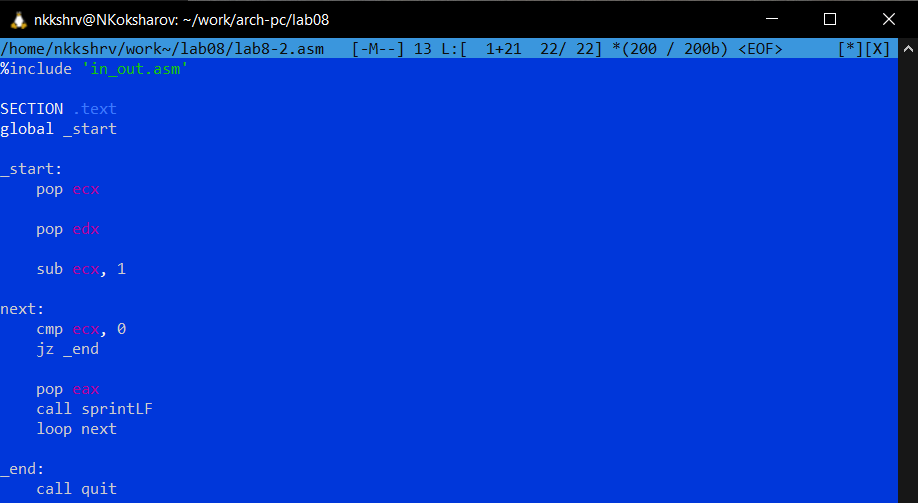{#fig:008 width=70%}

Создаю исполняемый файл и запускаю его, проверяю для 3 аргументов (рис. @fig:009)

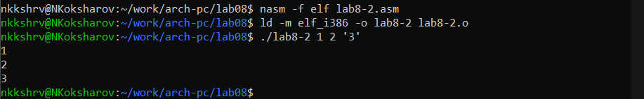{#fig:009 width=70%}

Все 3 аргумента были обработаны.

Создаю lab8-3.asm, пишу туда код из листинга 8.3 (рис. @fig:010)

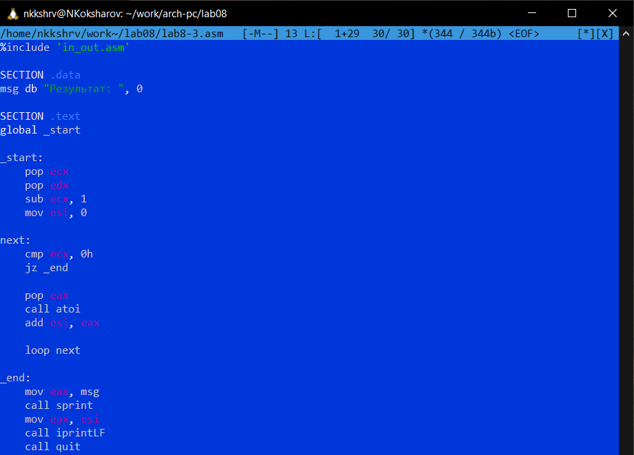{#fig:010 width=70%}

Создаю исполняемый файл и запускаю его, указав аргументы (рис. @fig:011)

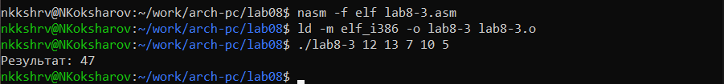{#fig:011 width=70%}

Меняю текст программы для вычисления произведения аргументов командной строки (рис. @fig:012)

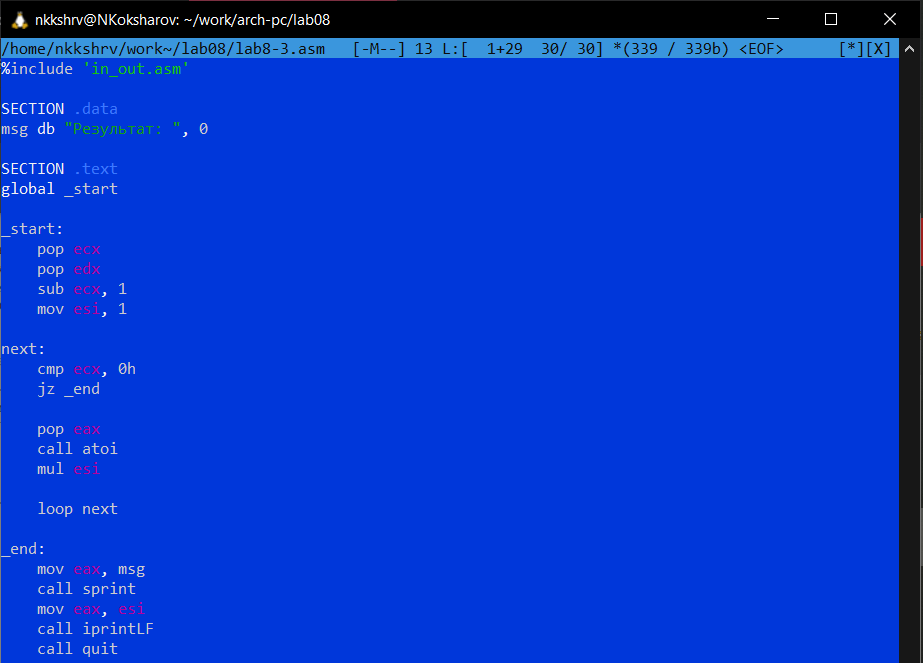{#fig:012 width=70%}

Создаю исполняемый файл и запускаю его, указав аргументы (рис. @fig:013)

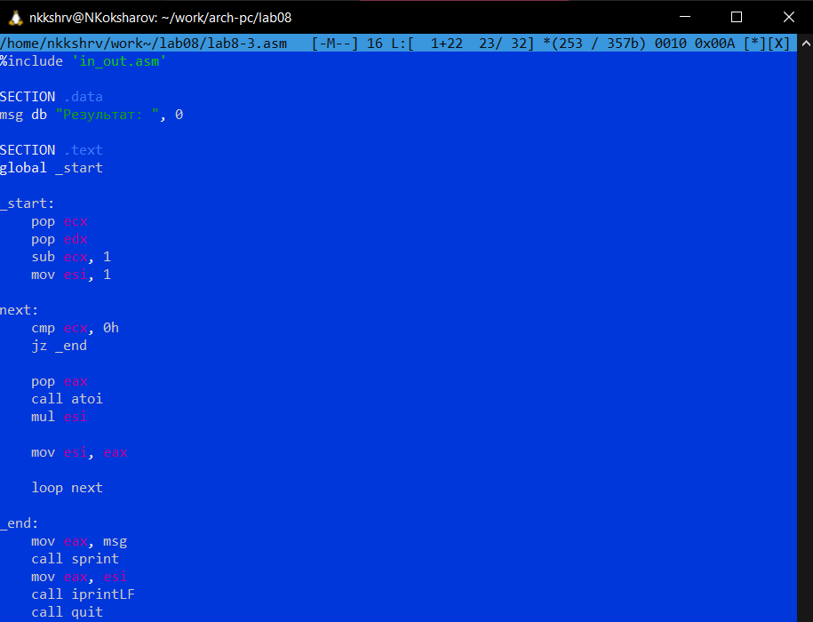{#fig:013 width=70%}

Результат верный.

## Задание для самостоятельной работы

Мой вариант: №18.

Пишу код программы для вычисления суммы значений функции $f(x) = 17 + 5x$ для $x = x_1, x_2, x_3, ..., x_n$ (рис. @fig:014)

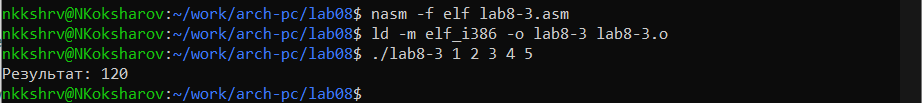{#fig:014 width=70%}

Результат верный.

Создаю исполняемый файл и запускаю его, указав аргументы (рис. @fig:015)

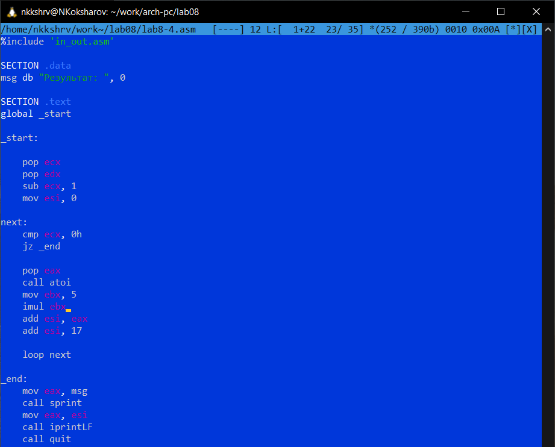{#fig:015 width=70%}

Результаты для разных наборов аргументов верны.

# Выводы

При выполнении лабораторной работы я приобрел навыки написания программ с использование циклов и обработкой аргументов командной строки.
