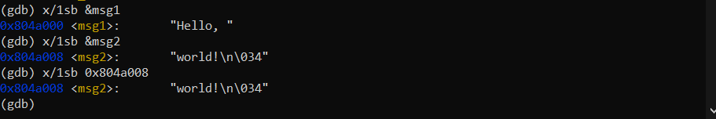
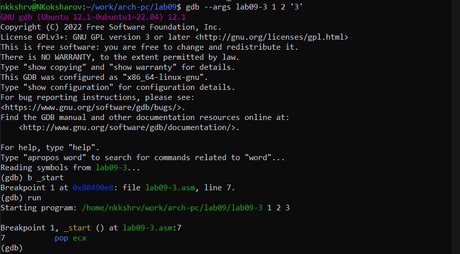
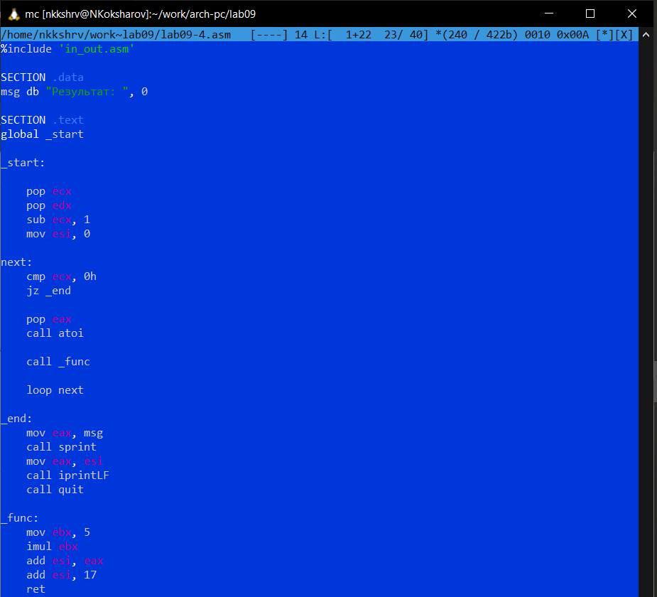

---
## Front matter
title: "Отчет по лабораторной работе №9"
subtitle: "Архитектура компьютеров и операционные системы"
author: "Никита Сергеевич Кокшаров"

## Generic otions
lang: ru-RU
toc-title: "Содержание"

## Bibliography
bibliography: bib/cite.bib
csl: pandoc/csl/gost-r-7-0-5-2008-numeric.csl

## Pdf output format
toc: true # Table of contents
toc-depth: 2
lof: true # List of figures
lol: false # List of listings
lot: false # List of tables
fontsize: 12pt
linestretch: 1.5
papersize: a4
documentclass: scrreprt
## I18n polyglossia
polyglossia-lang:
  name: russian
  options:
	- spelling=modern
	- babelshorthands=true
polyglossia-otherlangs:
  name: english
## I18n babel
babel-lang: russian
babel-otherlangs: english
## Fonts
mainfont: PT Serif
romanfont: PT Serif
sansfont: PT Sans
monofont: PT Mono
mainfontoptions: Ligatures=TeX
romanfontoptions: Ligatures=TeX
sansfontoptions: Ligatures=TeX,Scale=MatchLowercase
monofontoptions: Scale=MatchLowercase,Scale=0.9
## Biblatex
biblatex: true
biblio-style: "gost-numeric"
biblatexoptions:
  - parentracker=true
  - backend=biber
  - hyperref=auto
  - language=auto
  - autolang=other*
  - citestyle=gost-numeric
## Pandoc-crossref LaTeX customization
figureTitle: "Рис."
tableTitle: "Таблица"
listingTitle: "Листинг"
lofTitle: "Список иллюстраций"
lotTitle: "Список таблиц"
lolTitle: "Листинги"
## Misc options
indent: true
header-includes:
  - \usepackage{indentfirst}
  - \usepackage{float} # keep figures where there are in the text
  - \floatplacement{figure}{H} # keep figures where there are in the text
---

# Цель работы

Целью работы является приобретение навыков написания программ с использование подпрограмм, ознакомление с методами отладки при помощи GDB и его основными возможностями.

# Выполнение лабораторной работы

## Реализация подпрограмм в NASM

Создаю файл lab09-1.asm в новой директории lab09 (рис. @fig:001).

{#fig:001 width=70%}

Пишу код программы из листинга 9.1 (рис. @fig:002)

{#fig:002 width=70%}

Создаю исполняемый файл и запускаю его (рис. @fig:003)

{#fig:003 width=70%}

Ответ верный.

Изменяю код программы, добавляя подпрограмму _subcalcul, вычисляя значение $f(g(x))$, где $f(x) = 2x + 7$, $g(x) = 3x - 1$ (рис. @fig:004)

{#fig:004 width=70%}

Создаю исполняемый файл и запускаю его (рис. @fig:005)

{#fig:005 width=70%}

Ответ верный.

## Отладка программам с помощью GDB

Создаю lab09-2.asm, пишу туда код из листинга 9.2 (рис. @fig:006)

{#fig:006 width=70%}

Создаю исполняемый файл и запускаю его c помощью отладчика (рис. @fig:007)

{#fig:007 width=70%}

Ставлю точку останова на метку `_start` и запускаю программу(рис. @fig:008)

{#fig:008 width=70%}

Изучаю дизассемблированный код от отметки `_start` (рис. @fig:009)

{#fig:009 width=70%}

Переключаюсь на отображение команд с синтаксисом Intel (рис. @fig:010)

{#fig:010 width=70%}

Intel-синтаксис более читабелен в отличие от ATT-синтаксиса, поскольку порядок указания регистров идентичен тому, как он указан в коде.

Включаю режим псевдографики (рис. @fig:011)

{#fig:011 width=70%}

### Добавление точек останова

С помощью команды `info breakpoints` (`i b`) узнаю, где установлены точки останова (рис. @fig:012)

{#fig:012 width=70%}

Ставлю точку останова на предпоследней инструкции (рис. @fig:013)

{#fig:013 width=70%}

### Работа с данными программы в GDB

Выполняю 5 инструкций с помощью `stepi`. Изменяются значения регистров `eax`, `ebx`, `ecx`, `edx` (рис. @fig:014 - @fig:018)

{#fig:014 width=70%}

{#fig:015 width=70%}

{#fig:016 width=70%}

{#fig:017 width=70%}

{#fig:018 width=70%}

Узнаю содержимое регистров (рис. @fig:019)

{#fig:019 width=70%}

Узнаю содержимое `msg1` по имени, `msg2` по имени и адресу (рис. @fig:021)

{#fig:021 width=70%}

Меняю первый символ переменной `msg1` (рис. @fig:022)

{#fig:022 width=70%}

Меняю символ переменной `msg2` (рис. @fig:023)

{#fig:023 width=70%}

Вывожу значения регистра `edx` в шестнадцатеричном, двоичном и символьном видах (рис. @fig:024)

{#fig:024 width=70%}

Меняю значение регистра `ebx` (рис. @fig:025)

{#fig:025 width=70%}

Разница вывода комант `p/s $ebx` заключается в том, что сначала регистру присвоена строка `'2'`, а потом число $2$. Эти символы соответствуют разным кодам в UTF-8 (запрашивается значение именно в символьном виде).

### Обработка аргументов командной строки в GDB

Копирую файл lab8-2.asm, создаю исполняемый файл (рис. @fig:026)

{#fig:026 width=70%}

Запускаю отладку lab09-3, ставлю брейкпоинт перед первой инструкцией (рис. @fig:027)

{#fig:027 width=70%}

Обращаюсь к первым пяти позициям стека, где хранятся число аргументов командной строки, имя программы, и три аргумента (рис. @fig:028)

{#fig:028 width=70%}

Шаг равен изменения адреса равен 4, потому что каждая ячейка занимает 4 байта в памяти.

## Задание для самостоятельной работы

Преобразовываю код программы из лабораторной работы №8, реализуя вычисление значения функции как подпрограмму (рис. @fig:029)

{#fig:029 width=70%}

Создаю исполняемый файл и запускаю его (рис. @fig:030)

{#fig:030 width=70%}

Ответ для разного набора аргументов верный.

Создаю файл lab09-5.asm и пишу в нем код программы из листинга 9.3 (рис. @fig:031)

{#fig:031 width=70%}

Создаю исполняемый файл и запускаю его (рис. @fig:032)

{#fig:032 width=70%}

Результат действительно неверный: $(3 + 2) * 4 + 5 = 25$

C помощью отладчика пытаюсь найти ошибку в коде (рис. @fig:033)

{#fig:033 width=70%}

Нашедши ошибку, исправляю код (рис. @fig:034)

{#fig:034 width=70%}

Создаю исполняемый файл и запускаю его (рис. @fig:035)

{#fig:035 width=70%}

Ответ верный.

# Выводы

При выполнении лабораторной работы я приобрел навыки написания программ с использование подпрограмм и ознакомился с возможностями отладки с помощью GDB.
